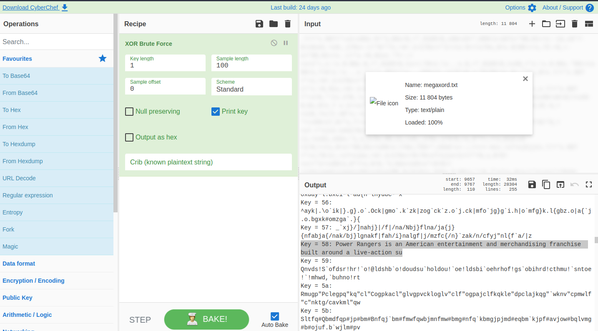
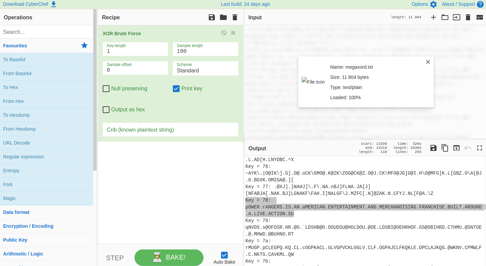
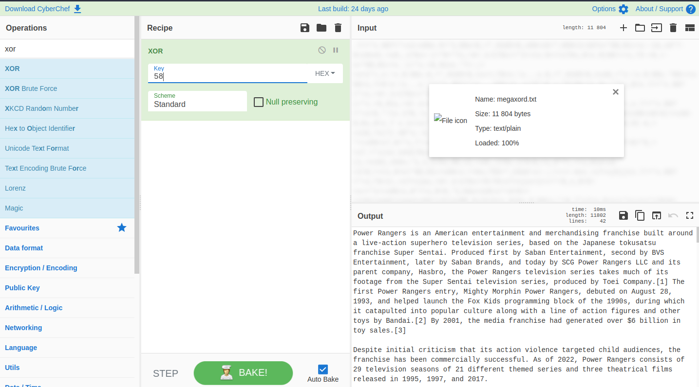
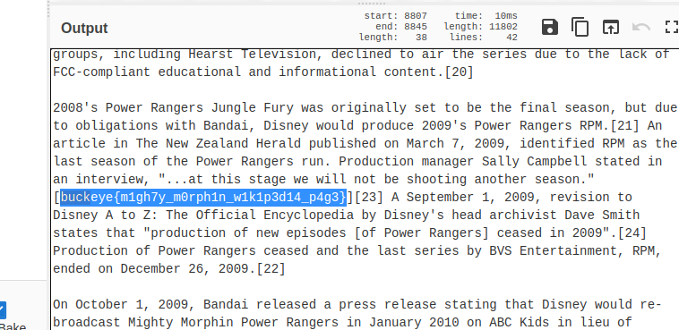

# crypto / megaxord
Author: gsemaj  
Downloads: [megaxord.txt](megaxord.txt)

### Task

> Some pesky wizard stole the article I was writing. I got it back, but it's all messed up now :(
> 
> Hint: the wizard used the same magic on every character...

В файле непонятная ерунда :)
```
7/=*x
96?=*+x1+x96x5=*1;96x=6,=*,9165=6,x96<x5=*;096<1+16?x>...
```

Название файла говорит нам, что над текстом была произведена операция XOR.  
Идем на сайт [https://gchq.github.io/CyberChef](https://gchq.github.io/CyberChef)  
Ищем XOR Brute Force. Вгружаем файл. Параметры оставляем по умолчанию.  
Смотрим на выходные последовательности ключей. Находим 2 более менее подходящие:





Ключ 58 и Ключ 78 подходят.  
Выбираем новый Recipe XOR  
Загружаем наш файл. Ключ устанавливаем в значение 58.



Получаем читаемый текст в котором ищем наш ключ. Так как ключи начинаются на ```buckeye``` можно 
осуществить поиск по тексту.



Наш флаг: ```buckeye{m1gh7y_m0rph1n_w1k1p3d14_p4g3}```