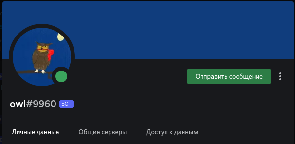
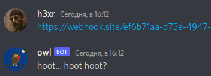
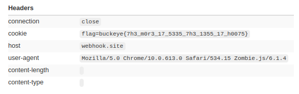

# web / owl
Author: gsemaj  
Downloads: [index.js](index.js)

### Task

> This bird never goes ANYWHERE without its flag, but is your site hootin' enough? ``` owl#9960 ```

Код из файла:
```js
const discord = require("discord.js");
const Browser = require("zombie");

const client = new discord.Client();
client.login(process.env.DISCORD_TOKEN);

const browser = new Browser();

function fly(url, content) {
	let bad = /<script[\s\S]*?>[\s\S]*?<\/script>/gi;

	return new Promise((resolve, reject) => {
		if(content.match(bad)) {
			resolve("hoot hoot!! >:V hoot hoot hoot hoot");
			return;
		}
	
		if(content.includes("cookie")) {
			resolve("hoooot hoot hoot hoot hoot hoot");
			return;
		}
	
		browser.visit(url, () => {
			let html = browser.html();
			if(html.toLowerCase().includes("owl")) {
				resolve("✨🦉 hoot hoot 🦉✨");
			} else {
				resolve("");
			}
		});
	})
}

function scout(url, host) {
	return new Promise((resolve, reject) => {
		if(!url.includes("owl")) {
			resolve("hoot... hoot hoot?");
			return;
		}

		browser.setCookie({
			name: "flag",
			domain: host,
			value: process.env.FLAG
		});

		browser.fetch(url).then(r => {
			return r.text();
		}).then(t => {
			return fly(url, t);
		}).then(m => {
			resolve(m);
		});
	});
}

client.on("ready", () => {
	console.log("Logged in as " + client.user.tag);
});

client.on("message", msg => {
	if(!(msg.channel instanceof discord.DMChannel))
		return;

	let url = /https?:\/\/(www\.)?([-a-zA-Z0-9@:%._\+~#=]{1,256}\.[a-zA-Z0-9()]{1,6}\b)([-a-zA-Z0-9()@:%_\+.~#?&//=]*)/i
	let match = msg.content.match(url);
	if(match) {
		scout(match[0], match[2]).then(res => {
			if(res.length > 0) {
				msg.channel.send(res);
			}
		});
	} else {
		if(msg.content.toLowerCase().includes("owl") || msg.mentions.has(client.user.id)) {
			msg.channel.send("✨🦉 hoot hoot 🦉✨");
		}
	}
});
```

> Подсказка 1:  
> const discord = require("discord.js");  
> Взаимодействие с Discord

> Подсказка 2:  
> ``` 
> browser.setCookie({
>           name: "flag",
>           domain: host,
>           value: process.env.FLAG 
> ```
> That code is just there to tell you that owl has the flag in it's browser cookies.

Будем взаимодействовать с Ботом ```owl``` в Discord сервере CTF



Функция:  
```
scout(url, host)
```
Возвращает сообщение ```hoot... hoot hoot?```, если в тексте сообщения нет слова ```owl```
```
if(!url.includes("owl")) {
			resolve("hoot... hoot hoot?");
			return;
		}
```
Если ```owl``` есть, устанавливает ```browser.setCookie``` и пытается выполнить ```fly()```  
Если в сообщении (сайте) есть ```<script>``` возвращает ```hoot hoot!! >:V hoot hoot hoot hoot```  
Если в сообщении (сайте) есть cookie, то возвращается ```hoooot hoot hoot hoot hoot hoot```  
И далее происходит переход по URL если в нем есть ```owl```

Воспользуемся сайтом [webhook.site](https://webhook.site/)  
[About Webhook.site](https://docs.webhook.site/)

> With Webhook.site, you instantly get a unique, random URL and e-mail address. Everything that's sent to these addresses are shown instantly. With this, you can test and debug Webhooks and HTTP requests, as well as create your own workflows using the Custom Actions graphical editor or WebhookScript, a simple scripting language, to transform, validate and process HTTP requests in a variety of ways – without setting up and maintaining your own infrastructure.

На стартовой странице получим рандомный URL типа ```	https://webhook.site/ef6b71aa...``` и 
попытаемся его вставить в сообщения бота.



Хммм..... Забыли ```owl```?
Добавим к строке с URL в конце /owl

Перейдем на сайт [webhook.site](https://webhook.site/) и посмотрим, что туда прилетело



Наш флаг ```buckeye{7h3_m0r3_17_5335_7h3_1355_17_h0075}```