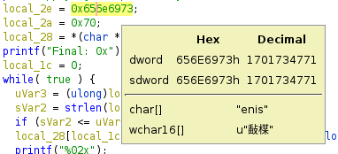
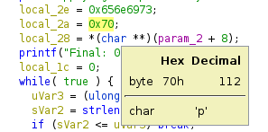

# rev / Sinep
Author: rene  
Downloads: [sinep](sinep)

### Task

> Sinep industries is advertising a Certified unbreakable encryption algorithm. Seeing as it's proprietary and Certified, I'm confident my data is safe. I'm so confident I'll straight up give you the flag.... ENCRYPTED hahahaha 0x111c0d0e150a0c151743053607502f1e10311544465c5f551e0e

Скачиваем файл и делаем ``` file sinep ```

```
sinep: ELF 64-bit LSB pie executable, x86-64, version 1 (SYSV), dynamically linked, interpreter /lib64/ld-linux-x86-64.so.2, BuildID[sha1]=fc4dc90e2a8221a1008ac53d5bbee9e893047f5c, for GNU/Linux 3.2.0, not stripped
```

### Вариант решения 1
Меняем расширение файла на .sh и делаем его исполняемым.
Запускаем ./sinep.sh  
Программа просит ввести некий текст  
``` Please enter the text to apply Sinep's patented algorithm. ```

Вводим "1"  
```
Your plain text: 1
Applying Sinep Industry's Certified unbreakable algorithm.
Final: 0x42
```

Получаем некое значение 0x42. Хмм... 
Так как наш флаг состоит из ``` buckeye{ ``` попробуем подставить его текстом во входное значение
``` ./sinep.sh buckeye{ ```

```
Your plain text: buckeye{
Applying Sinep Industry's Certified unbreakable algorithm.
Final: 0x111c0d0e150a0c15
```

Полученная последовательность чудесным образом похожа на стартовую
``` 0x111c0d0e150a0c151743053607502f1e10311544465c5f551e0e ```

Далее, методом перебора получим наш флаг:  
``` buckeye{r3v_i5_my_p45510n} ```

### Вариант решения 2

Открываем Ghidra и ищем main

```c++
undefined8 main(int param_1,long param_2)

{
  undefined8 uVar1;
  size_t sVar2;
  ulong uVar3;
  undefined4 local_2e;
  undefined2 local_2a;
  char *local_28;
  int local_1c;
  
  if (param_1 == 2) {
    printf("Your plain text: %s\n");
    puts("Applying Sinep Industry\'s Certified unbreakable algorithm.");
    local_2e = 0x656e6973;
    local_2a = 0x70;
    local_28 = *(char **)(param_2 + 8);
    printf("Final: 0x");
    local_1c = 0;
    while( true ) {
      uVar3 = (ulong)local_1c;
      sVar2 = strlen(local_28);
      if (sVar2 <= uVar3) break;
      local_28[local_1c] = *(byte *)((long)&local_2e + (long)(local_1c % 5)) ^ local_28[local_1c];
      printf("%02x");
      local_1c = local_1c + 1;
    }
    putchar(10);
    uVar1 = 0;
  }
  else {
    puts("Please enter the text to apply Sinep\'s patented algorithm.");
    uVar1 = 1;
  }
  return uVar1;
}
```

``` local_2e = 0x656e6973; ```



``` local_2a = 0x70; ```



Решение задачи [by msymt](https://github.com/msymt/ctf-writeup/tree/main/buckeyectf2022)  
Код [тут](solution.py)
