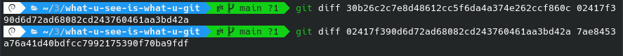
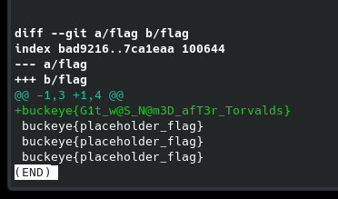

# misc / what-you-see-is-what-you-git
Author: matthewa26  
Downloads: [what-you-see-is-what-you-git.zip](what-you-see-is-what-you-git.zip)

### Task

> I definitely made a Git repo, but I somehow broke it. Something about not getting a HEAD of myself.

В описании задания есть отсылка к HEAD, будем смотреть в ту сторону.
Распаковываем архив и идем в .git

Любые попытки вызвать:  
``` git log ```
``` git log -p ```  

Не увенчались успехом и Git предательски молчал или выдавал ошибку  

``` fatal: your current branch 'main' does not have any commits yet ```

Лезем ручками в файлы и смотрим на ``` .git/HEAD ```  
Ничего интересного
``` ref: refs/heads/main ```

Смотрим дальше ``` .git/logs/HEAD ```  

```
0000000000000000000000000000000000000000 30b26c2c7e8d48612cc5f6da4a374e262ccf860c NOT Gent Semaj  <jim@bo.hacked> 1667608995 -0400	commit (initial): Initial commit
30b26c2c7e8d48612cc5f6da4a374e262ccf860c 02417f390d6d72ad68082cd243760461aa3bd42a Shannon's Man <peanut@butter.jellytime> 1667609597 -0400	commit: Added Andy Warhol effect to file

7ae8453a76a41d40bdfcc7992175390f70ba9fdf c4681c8d561653cee9ecbea5d5ca5629adfd67a4 Matthew Ayers <matt@matthewayers.com> 1667704926 -0400	commit: Hid the flag
```

Видим коммиты  
Воспользуемся ``` git diff ``` на коммитах, перебирая их по очереди





Получили флаг  
``` buckeye{G1t_w@S_N@m3D_afT3r_Torvalds} ```
