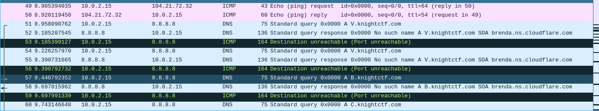
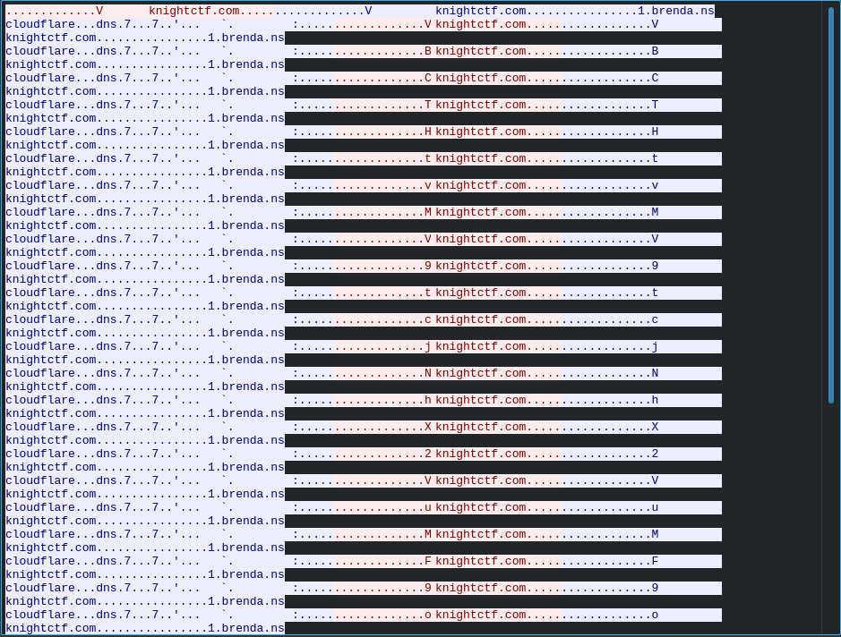
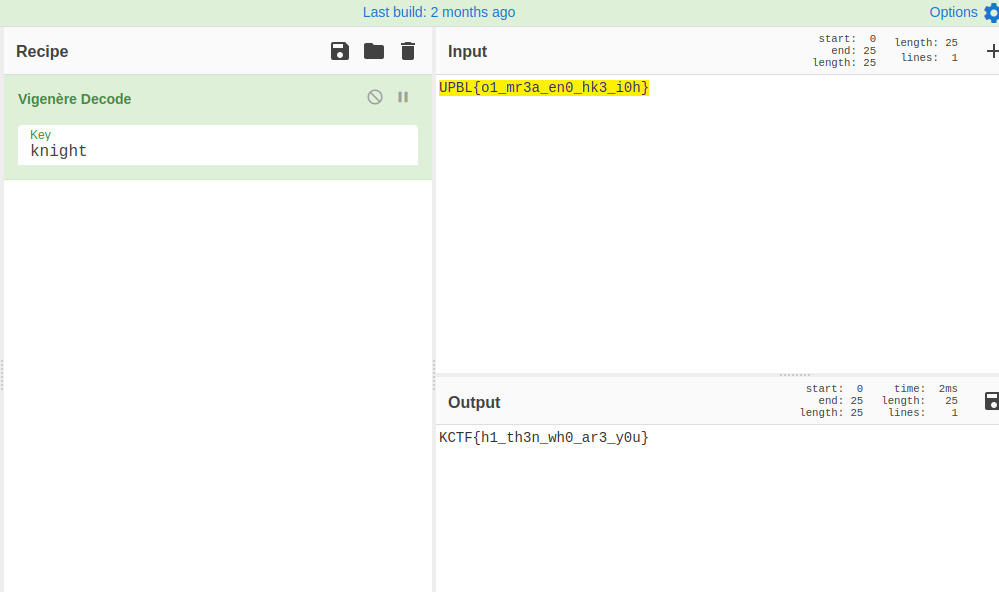

# NETWORKING / Hello
Downloads: [find-me.pcapng](find-me.pcapng)

### Task:

> Sir vignere came to my dreams and sent me this packet capture and told me to find the flag 
> from it which is the key to my success. I am a noob in these cases. So I need your help. 
> Please help me find the flag. Will you?  
> Attachment : File  
> Demo Flag: KCTF{fl4g_h3r3}  

### Solution: 

1. Open `.pcapng` file  
2. Now we see that the DNS is quite strange  



3. Let's follow UDP stream



4. We do have some letters in DNS query
5. Let's wright them down
6. `VBCTHtvMV9tcjNhX2VuMF9oazNfaTBofQ==`
7. Decode - no result. But we forgot another "V"
8. `VVBCTHtvMV9tcjNhX2VuMF9oazNfaTBofQ==`
9. Decode it `UPBL{o1_mr3a_en0_hk3_i0h}`

> Steps [5-9] can be done like this:
> ```commandline
> tshark -r find-me.pcapng -Tfields -e dns.qry.name > dns_names.txt
> ```
> ```commandline
> cat dns_names.txt | uniq > dns_names_uniq.txt
> ```
> Then use [script](dns_letters.py)

10. So we got Flag, but it is not normal (no 'KCTF')
11. We have a hint in the task - "Sir vignere"
12. Lets go and try to decode a flag

