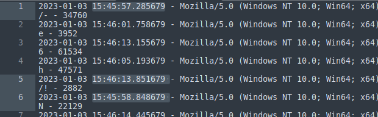

# MISC / Logger
Author: fazledyn  
Downloads: [misk-access.log](misc-access.log)

### Task:

> Sysadmin found an access log that contains some requests to weird endpoints. It's said that 
> the flag lies among them. Are you smart enough to find it?  
> Demo Flag: KCTF{t3xt_h3re}  
> Attachment: File  
> Author: fazledyn

### Solution: [solution.py](solution.py)

1. Open `.log` file  
2. Now we see that the `.log` is not additionally ordered by time  

3. Let's order it
4. We have letters after "GET /"
5. Let's write script to take [148] symbol and append it to string
6. Search fo 'KCTF'