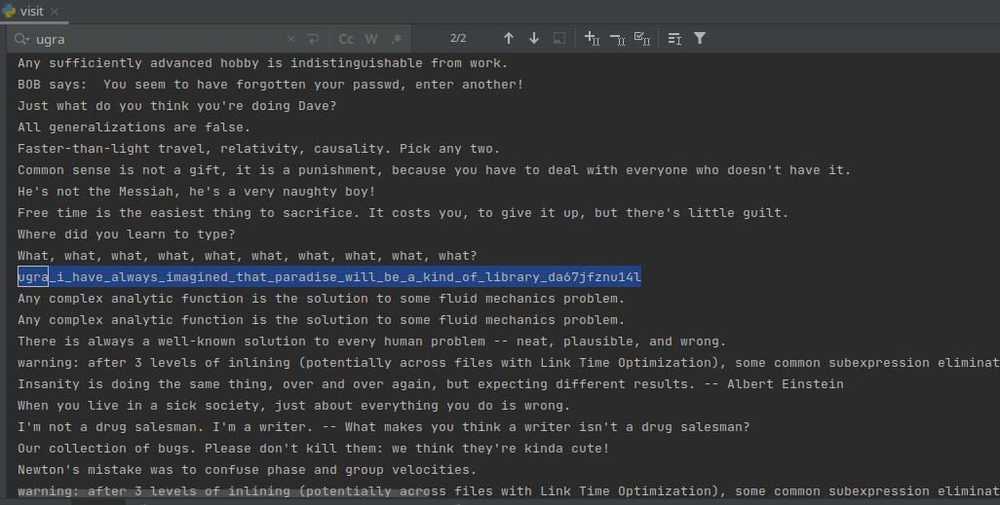

# PPC / Глубина
Author: [ivanq](https://ucucu.ga/ivanq)  
Задание: https://q.2023.ugractf.ru/tasks/depth/  
URL: https://depth.q.2023.ugractf.ru/qzu0wf8672wu1w1f

### Задание

> У каждого есть знакомый с под сотней файлов на рабочем столе. Но, оказывается, бывает и хуже...

### Решение: 

При открытии сайта получаем "Index of"... 4 каталога, в 3х из котрых текст и 1 содержит в себе 
папку следующего уровня.  
Можно ходить руками по папкам - но это очень долго.  
Можно воспользоваться `wget`

```commandline
wget -r -l inf --adjust-extension <URL>
```
Но на некотором этапе он остановится на `File name too long`  
Можно докрутить `wget` или воспользоваться скриптом:
```python
import re
import requests

def visit(path):
    text = requests.get(path).text
    if "Index of" not in text:
        print(text)
        return

    for match in re.finditer(r"HREF=(\w+)/", text):
        word = match.group(1)
        visit(path + "/" + word)

visit("<URL>")
```

Результат:

