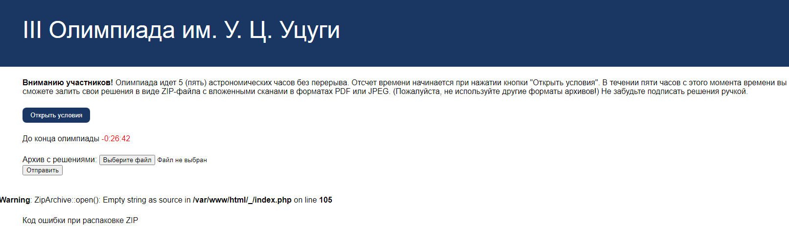
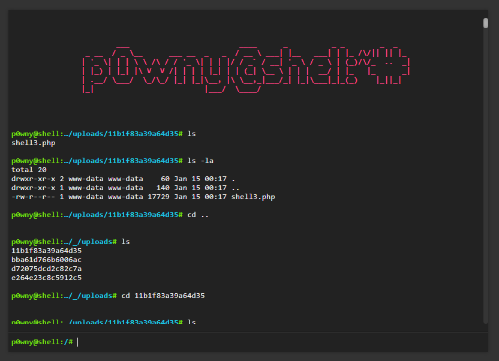
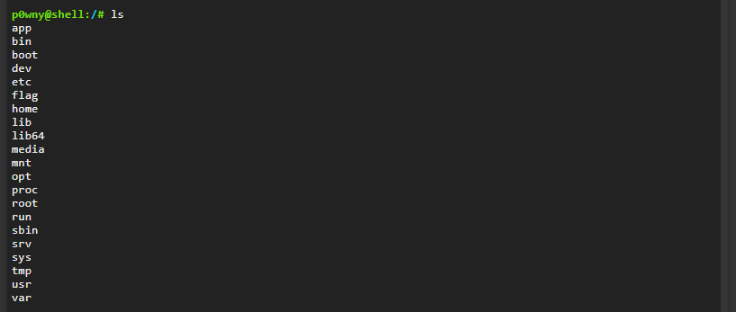
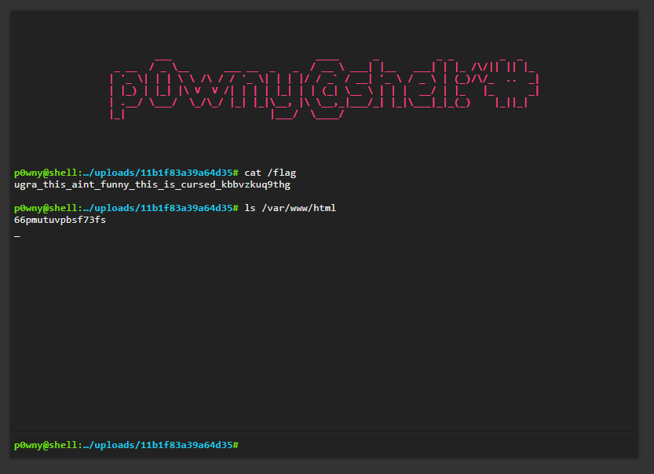

# CTB / Доказательство запугиванием
Author: [ivanq](https://ucucu.ga/ivanq)  
Задание: https://q.2023.ugractf.ru/tasks/proofbyintimidation/  
URL: https://proofbyintimidation.q.2023.ugractf.ru/66pmutuvpbsf73fs

### Задание

> Если бы олимпиады разрабатывали математики, потерявшие связь с реальностью, то они бы выглядели как-то так. Хотя постойте...

### Решение:

Переходим на страницу и видим:


Открываем условия

[Условия](statements.pdf)

Выглядит страшно :)

По условию задачи нам ужно подгрузить PDF или ZIP.
Попробуем подгрузить ничего.

Сервер сообщит об ошибке распаковки
```
Warning ZipArchive::open(): Empty string as source in /var/www/html/_index.php on line 105
```


Ага... Льем [shell](https://github.com/flozz/p0wny-shell/blob/master/shell.php)  
После загрузки сайт сообщает, какие и где файлы мы залили.
Переходим и ...



Поползав по папкам, находим flag




