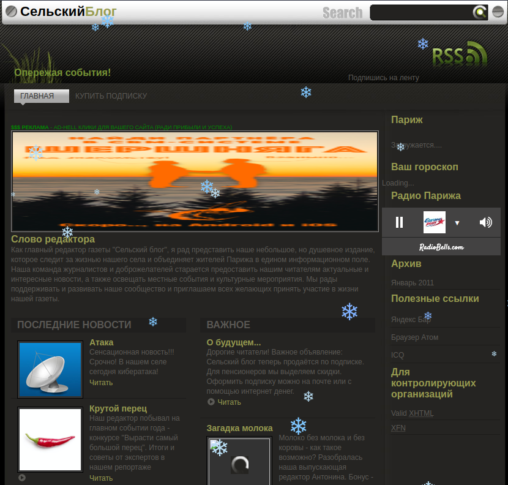
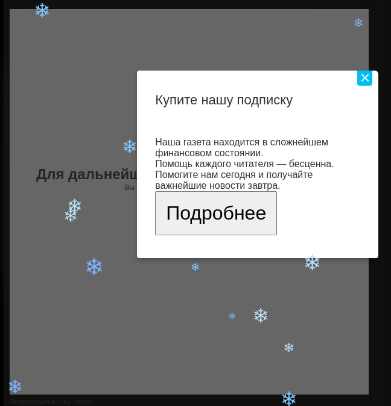
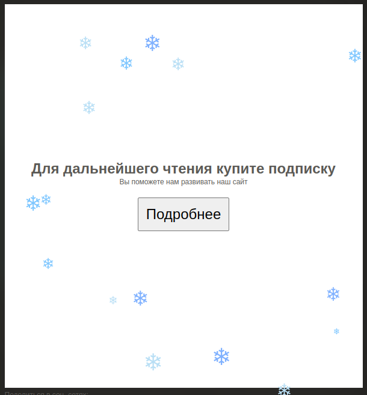
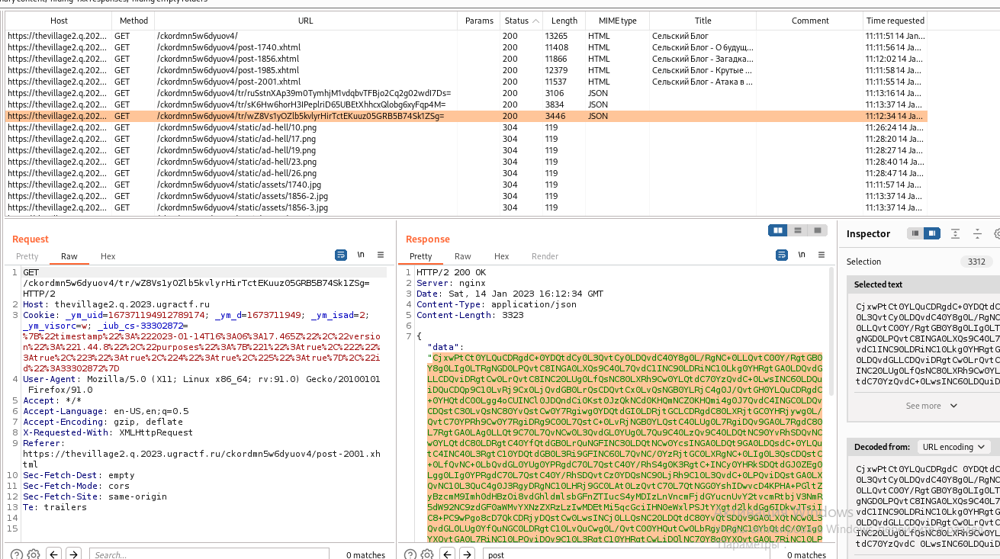
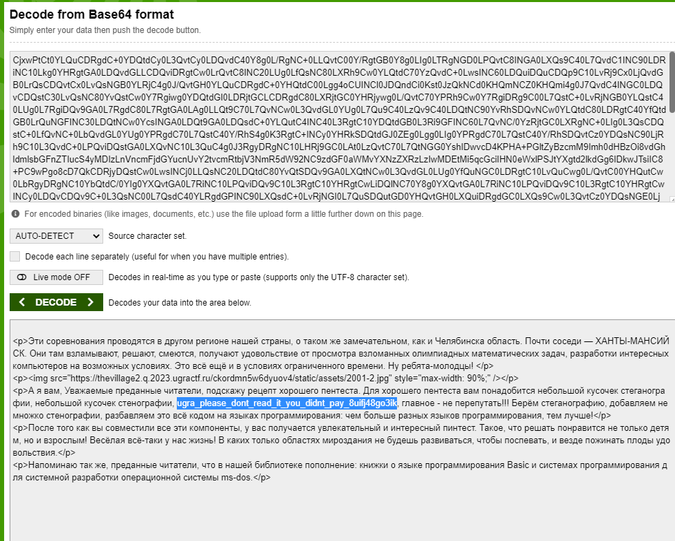

# WEB / Сельский блог
Author: [nsychev](https://ucucu.ga/nsychev)  
Задание: https://q.2023.ugractf.ru/tasks/thevillage2/  
URL: https://thevillage2.q.2023.ugractf.ru/ckordmn5w6dyuov4

### Задание

> К сожалению, Сельский клуб закрылся, не продержавшись на вершине медиабизнеса даже трёх 
> месяцев. А вот местная Сельская служба новостей пережила временное падение рейтингов и снова 
> вышла на стабильный показатель в 14 читателей.  
>
> Однако, теперь перед изданием встала проблема гораздо серьёзнее — глобальная рецессия. А это 
> отток рекламодателей и, как следствие, серьёзных финансовых потоков.  
>
> С целью сохранения редакции было принято беспрецедентное решение — введение платной подписки 
> на тексты издания. Беспрецедентно оно тем, что качество текстов ни на йоту не повысилось. Как 
> и информационная безопасность веб-сайта издания.  

### Решение

Переходим на сайт по ссылке

Наблюдаем некий сайт.
Поползаем по страницам, так как в условии сказано "введение платной подписки на тексты издания"

Видим что на страницах есть некий контент, который не хочет загружаться.
Открываем BurpSuite.

При загрузке страниц нам пвозвращается некое зашифрованное `{ data }`
Идем расшифровывать

В тексте обнаруживаем наш флаг